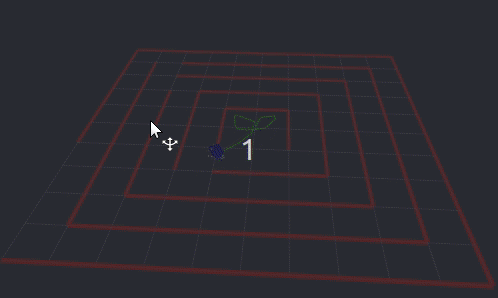

# Differential Robot - ROS Maze Navigation

This package contains a simulation of a differential-drive robot using URDF/Xacro. A navigation algorithm was implemented to guide the robot through a maze-escape task based on simulated LiDAR data.

## Demo

*Autonomous navigation with LiDAR scanning, obstacle avoidance, and path planning in simulated maze environment.*




## Overview

This project simulates a differential drive robot equipped with a LiDAR sensor autonomously navigating through a multi-layered maze. This package simulate a differential robot with LiDAR sensor autonomosouly  package includes:

- **Robot Model**: URDF description with visual and collision properties
- **Sensor Simulation**: Simulated LiDAR with ray-casting against maze walls
- **Navigation Algorithm**: Wall-following algorithm with obstacle avoidance
- **Visualization**: RViz integration for real-time visualization
- **Arduino Emulation**: Simulates motor control interface

## Project Structure

```
differential_robot/
├── media/
│   └── Demo.gif          
├── launch/
│   └── rviz.launcher          # Main launch file for visualization
├── robot/
│   ├── materials.xacro        # material definitions for robot components
│   └── robot.xacro            # Complete robot URDF model
├── rviz/
│   └── robot.rviz             # RViz configuration preset
├── src/
│   ├── arduino.py             # Arduino motor controller emulator
│   ├── broad_lidar.py         # Simulated LiDAR publisher
│   ├── broad_robot.py         # Main navigation controller
│   ├── client.py              # Service client for pose reset
│   └── lidar_data.py          # Maze visualization publisher
├── srv/
│   └── reset.srv              # Custom service for pose reset
└── CMakeLists.txt & package.xml
```

##  Installation

```bash
cd ~/catkin_ws/src
git clone https://github.com/<your_username>/differential_robot.git
cd ..
catkin_make
source devel/setup.bash
```

## Launch the Simulation

1. Start robot, LiDAR, navigation, markers, and RViz:
```bash
roslaunch differential_robot rviz.launch
```


## Nodes Overview

### **1. simulated_lidar (`broad_lidar.py`)**

Simulates 360° LiDAR using ray-casting against maze walls.

**Publishes**

* `/scan` (sensor_msgs/LaserScan)
* TF: `base_link → hokuyo_link`

---

### **2. maze_navigator (`broad_robot.py`)**

Autonomous robot controller: obstacle avoidance + wall following + odometry.

**Publishes**

* `/cmd_vel`
* `/robot_path` (nav_msgs/Path)
* TF: `world → base_link`

**Subscribes**

* `/scan`

**Service**

* `/reset_pose` (reset.srv)


### **3. maze_marker_publisher (`lidar_data.py`)**

Publishes maze wall lines using RViz markers.

**Publishes**

* `/visualization_marker`


### **4. arduino_emulator (`arduino.py`)**

Receives velocity commands and prints them (debug motor interface).

**Subscribes**

* `/cmd_vel`


### **5. reset_pose_client (`client.py`)**

Calls reset service:

```bash
rosrun differential_robot client.py
```


##  URDF Robot

Robot defined in:

* `robot/robot.xacro`
* `robot/materials.xacro`

Includes:

* Base link
* Chassis
* Left & right wheels
* Caster wheel
* LiDAR sensor
* Materials (blue, white, black)


##  Reset Pose Service

### Service definition

```
float32 x
float32 y
float32 yaw
---

### Call manually
You can call this service manulay by using this:
```bash
rosservice call /reset_pose 0 0 0
```


## RViz Visualization

Load the provided configuration:

```bash
rviz -d $(rospack find differential_robot)/rviz/robot.rviz
```

Displays:

* URDF model
* TF tree
* LiDAR scan
* Maze walls
* Robot path


##  Topics Summary

| Topic                        | Type          | Published By          |
| ---------------------------- | ------------- | --------------------- |
| `/scan`                      | LaserScan     | simulated_lidar       |
| `/cmd_vel`                   | Twist         | maze_navigator        |
| `/robot_path`                | nav_msgs/Path | maze_navigator        |
| `/visualization_marker`      | Marker        | maze_marker_publisher |
| TF `world → base_link`       | TF            | maze_navigator        |
| TF `base_link → hokuyo_link` | TF            | simulated_lidar       |


## Navigation Behavior and Control algorithm
The Control algorithm used to escape the maze can be described by these rules:
* Stops & turns if obstacle < **0.5 m** in front
* Right-hand **wall following** (0.3 m distance)
* Free-space turning preference
* Odometry simulated from `/cmd_vel`
* Path recorded continuously


## Author

This package was developed by Tala Khaddour


